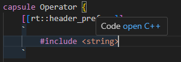
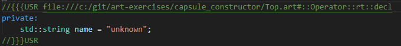

### Pass information to capsule instances in parts by means of a capsule constructor

Previously we learnt about [parts](https://secure-dev-ops.github.io/code-realtime/art-lang/#part) and how to populate them with capsule instances, either automatically at construction (for fixed parts) or manually at any time (for optional parts). The created capsule instances can use APIs from the TargetRTS class [`RTActor`](https://secure-dev-ops.github.io/code-realtime/targetrts-api/class_r_t_actor.html) to get information such as the name of the part that contains it and the index (in case the part has non-single multiplicity). In this exercise we'll look at how you can pass arbitrary initialization data to the created capsule instances.

Just like any C++ class, a capsule can have [constructors](https://secure-dev-ops.github.io/code-realtime/art-lang/#capsule-constructor). A capsule constructor has two mandatory parameters:

* [RTController](https://secure-dev-ops.github.io/code-realtime/targetrts-api/class_r_t_controller.html)* **rtg_rts**: This is the [controller](https://secure-dev-ops.github.io/code-realtime/target-rts/message-communication/#controllers-and-message-queues) which runs the capsule instance. We'll look deeper into controllers in a future exercise, and for now you can just think about this parameter as a representation of the thread that runs the capsule instance's state machine.
* [RTActorRef](https://secure-dev-ops.github.io/code-realtime/targetrts-api/class_r_t_actor_ref.html)* **rtg_ref**: This is the part into which the created capsule instance will be placed.

The default capsule constructor only has these two mandatory parameters. You can create additional capsule constructors with extra parameters in order to pass any data to the created capsule instances.

1. The <a class="open-file-link" href="Top.art">top capsule</a> of this exercise is called `ResourcePool` and represents a pool of operators that can operate a machine in a factory. An operator is represented by the `Operator` capsule, and each operator is identified by a name. Assume that there are 3 operators in the resource pool; 2 employees which are always there and 1 contractor which can be available when necessary. Create a fixed part `employees` with multiplicity 2, and an optional part `contractor` with multiplicity `[0..1]` to represent the operators in the `ResourcePool` capsule.
2. Make the (<a class="open-file-link" href="app.tcjs">TC</a>) active to ensure C++ code is generated for it.
3. The `Operator` capsule has a member variable `name` which stores the name of the operator. Note that since this member variable has the type `std::string` the capsule includes the <string> header file in its `rt::header_preface` code snippet. All code that you write in that code snippet will appear at the beginning of the header file that is generated for the capsule. Rest your cursor at the `rt::header_preface` code snippet. Since generated C++ code now is available you should see a hyperlink that you can click for navigating to the code snippet inside the generated code.



Alternatively you can accomplish the same thing by means of the context menu command **Open Generated Code**.

4. Try navigating to generated code also for the `rt::decl` code snippet where the member variable `name` is defined.
5. Initialize the `name` member variable to the string `"unknown"`. Decide yourself if you make the change in the generated code or in the Art file.



6. Build and run the application. You should see 2 printouts `I'm unknown` coming from the capsule instances in the fixed part `employees` (since it has multiplicity 2).
7. Create a constructor for the `Operator` capsule. The easiest way to do it is to place the cursor on a new line after the `name` member variable declaration, press `ctrl+space` and perform the command **New Constructor**. The prototype of a default capsule constructor is added. Set the visibility of the constructor to **public** so it can be accessed by the `ResourcePool` capsule.
8. Add an additional constructor parameter `const std::string& operatorName` after the two mandatory parameters.
9. Write the implementation of the capsule constructor in an `rt::impl` code snippet. It doesn't matter where in the `Operator` capsule you place this code snippet, but it's natural to put it right after the `rt::decl` code snippet. Once you have the empty `rt::impl` code snippet you can implement the constructor by `ctrl+space` and then perform the command **New Constructor**. Remember to add the same `operatorName` parameter to the constructor implementation, and initialize the `name` member variable with it.
10. Again build and run the application. Now there will be 2 errors printed by the TargetRTS:

```shell
incarnate(application(ResourcePool)<<machine>>.employees[0]): Not a compatible subclass.
incarnate(application(ResourcePool)<<machine>>.employees[1]): Not a compatible subclass.
```

The reason for these errors is that now that we have defined a custom capsule constructor that takes an additional 3rd parameter, the TargetRTS no longer can create the capsule instances in the fixed capsule part using only the two mandatory parameters. That is, the introduction of the user-defined capsule constructor at the same time removed the default capsule constructor. To fix these errors we need to pass an argument for the 3rd constructor parameter. The way this is done is different for a fixed and an optional capsule part.

11. For a fixed part we need to specify a [capsule factory](https://secure-dev-ops.github.io/code-realtime/art-lang/#part-with-capsule-factory) with an `rt::create` code snippet that creates the capsule instances. Place the cursor before the semicolon `;` in the declaration of `employees`, press `ctrl+space` and perform the command **New Create Function**. 
12. Implement the create function like this:

```art
part employees : Operator[2] [[rt::create]]
`
    std::string name = (index == 0) ? "Bob" : "Alice";
    return new Operator(rtg_rts, rtg_ref, name);
`; 
```

If you navigate to this code snippet in the generated code you'll see that the create function has access to 3 parameters. `rtg_rts` and `rtg_ref` are the two mandatory capsule constructor parameters explained above. The third parameter is `index` which specifies the index where the created capsule instance will be inserted into the part. The above implementation uses `index` to give the first Operator instance (at `employees[0]`) the name "Bob" and the second Operator instance (at `employees[0]`) the name "Alice".
13. Again run and build the application. You should now see correct printouts for the capsule instances in `employees`.

```shell
I'm Bob
I'm Alice
```

14. For an optional part we need to use a different way to pass the constructor arguments since capsule instances then are created programmatically using TargetRTS APIs. Instead of using the function `incarnate()` which you have previously used for incarnating optional parts, you instead need to use the function `incarnateCustom()`. It allows you to pass an [RTActorFactory](https://secure-dev-ops.github.io/code-realtime/targetrts-api/class_r_t_actor_factory.html) object constructed from a lambda function where you can specify how to create the capsule instance. Create a frame port and call `incarnateCustom()` on it like this:

```cpp
frame.incarnateCustom(contractor, RTActorFactory([this](RTController * c, RTActorRef * a, int index) {
    return new Operator(c, a, "Steve"); 
}));
```

Just like with the create function for a fixed part, the lambda function gets the 3 parameters `rtg_rts`, `rtg_ref` and `index`.

_Note:_ For capsule instances created in optional parts there is an alternative way of passing initialization data using an overload of `incarnate()` that takes a data pointer argument. That data can then be obtained through the `rtdata` parameter in the initial transition of the capsule. However, use of capsule constructors is usually the better way to initialize a capsule because 

1. it doesn't rely on untyped data (`void*`), and all constructor parameters can be properly typed
2. it allows initialization of all kinds of capsule member variables, including references
3. it works also for fixed capsule parts
4. it ensures the capsule instance is initialized at the time of construction, rather than at the time when the initial transition runs (which happens a little later)