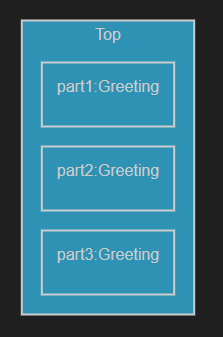

### Make the application print 3 unique greetings by using fixed capsule parts

A capsule can be decomposed into [parts](https://secure-dev-ops.github.io/code-realtime/art-lang/#part). Such a part is typed by another capsule, with its own state machine. If a capsule part is declared with the **fixed** keyword (which is the default if the keyword is omitted) then an instance of the capsule that types the part will be automatically created when the container capsule instance is created.

1. Create 3 parts in the <a class="open-file-link" href="Top.art">Top</a> capsule, all typed by the `Greeting` capsule. Call the parts `part1`, `part2` and `part3`. 
2. Open the structure diagram of the `Top` capsule to view the top capsule and its parts graphically. You do this by right-clicking inside `Top` and performing the context menu command **Open Structure Diagram**. 

3. Now build and run the application and you should see 3 printouts of the message "Hello". 
4. Make each greeting unique by appending the string `" from P"` to the greeting, where `P` is the name of the part that contains the capsule instance that prints it. Use the `getName()` function which is available in any capsule since it's translated to a class that inherits from the TargetRTS class [`RTActor`](https://secure-dev-ops.github.io/code-realtime/targetrts-api/class_r_t_actor.html). 

_Note:_ The order of the printouts corresponds to the order in which the parts are defined in the capsule. This shows that the capsule instances contained in the fixed parts are created in that order. However, in a real application it's usually not advisable to let the behavior rely on this order. In later exercises you will learn how the container capsule can decide when to create the capsule instances contained in its parts and also how it can communicate with them by means of sending events.