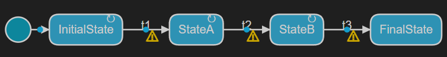

### Make the state machine go to the next state only when it receives increasing data values

A [transition](https://secure-dev-ops.github.io/code-realtime/art-lang/#transition) can have a **guard** which decides if the transition can run or not. A guard is a boolean condition and only when it evaluates to `true` can the transition be run. Guards are for example useful if there are more than one transition that can be triggered when a certain event is received in a certain state. Without guards it's ambiguous what should happen if that event is received. One of the transitions will execute, but it may not be the one you want to execute. If you add guards for such transitions, and ensure that exactly one of these guard conditions is `true` at any point in time, then there is no ambiguity anymore and you can precisely control which transition that should be run.

An [internal transition](https://secure-dev-ops.github.io/code-realtime/art-lang/#internal-transition) is a transition that is defined inside a state, and which doesn't change the active state when triggered.

The <a class="open-file-link" href="Top.art">Top</a> capsule of this exercise has a state machine with transitions that can take it from `InitialState` to `FinalState` when it has received <a class="open-file-link" href="Events.art">theEvent</a> 3 times. Your task is to extend the application so it only proceeds to the next state if the `float` data of `theEvent` is higher than the previously received value. If the event data value is equal or lower than before, the state machine should stay in its current state.

1. Open the state diagram of the <a class="open-file-link" href="Top.art">Top</a> capsule. Note that the transitions `t1`, `t2` and `t3` are marked with warnings (the warnings can also be seen in the Art text editor on the transition names).



If you don't see these warnings make sure you have set the TC as active. This particular warning is emitted during code generation, which only happens once the TC is active.

2. Rest your cursor on the warning (either in the diagram or in the Art text editor) and make sure you understand what it means. In each of the states `InitialState`, `StateA` and `StateB` there are two triggered transitions (one of which is an [internal transition](https://secure-dev-ops.github.io/code-realtime/art-lang/#internal-transition) called `tooLow`). Both these transitions trigger on the same event `theEvent` which makes it ambiguous which one to run when `theEvent` is received.

3. Build the application and debug it with the Art debugger. Send `theEvent` on the `comPort` and note that the state machine stays in the `InitialState`. From this we can conclude that the internal transition was run and not `t1`.

_Note:_ In a real application it's not recommended to have ambiguities in which transition to run when an event is received. That is the reason why a warning is emitted by the code generator when it encounters this situation.

4. Locate the target folder `guards_target` in the Explorer view and open the file `Top.cpp` that contains the C++ code that was generated for the `Top` capsule state machine. Scroll down to the function `rtsBehavior()`. This is a virtual function in [RTActor](https://secure-dev-ops.github.io/code-realtime/targetrts-api/class_r_t_actor.html) which is overridden in `Top.cpp` to provide the implementation of the capsule state machine. Note that there is a warning about unreachable code printed before the call to the `t1` transition function. This corresponds to the warning you see in the Art file and in the state diagram. 

```cpp
case 2 /* InitialState */:
    switch( portIndex )
    {
    case 0 /* RTControlPort */:
        switch( signalIndex )
        {
        case 1 /* RTInitSignal */:
            return ;
        default:
            break;
        }
        break;
    case 1 /*comPort*/:
        switch( signalIndex )
        {
        case Events::Base::rti_theEvent:
            chain1_tooLow(  );
            return ;
            // WARNING: unreachable code;
            chain5_t1(  );
            return ;
        default:
            break;
        }
        break;
    default:
        break;
    }
    break;
```

5. Write guards for all triggered transitions so that the state machine only goes to the next state if the data value that is received with `theEvent` is higher than what was received before. The member variable `lastData` stores the previously received value. Note that adding guards to the transitions fixes the warnings.

6. Each of the internal transitions calls the function `logTooLow`. Implement this function so it prints a message on this form to `stdout`:

```shell
Staying in <CURRENT STATE> because received data is too low: <RECEIVED DATA VALUE> is not higher than previous data <LAST DATA>
```

where `<CURRENT STATE>` is the name of the currently active state, `<RECEIVED DATA VALUE>` is the value that was received with `theEvent` and `<LAST DATA>` is the value stored in `lastData`.

7. Use the Art debugger to test that the application works correctly. Each time you send `theEvent` on the `comPort` the data of the event must be higher for the state machine to transition to the next state. If it's equal or lower than the previously received value, it should stay in the current state. Use the **Debug Console** to verify that the application works correctly.

8. Turn on [manual layout](https://secure-dev-ops.github.io/code-realtime/working-with-art/diagrams/#automatic-vs-manual-layout) for the state diagram so you can arrange the states and transitions vertically instead of horisontally.