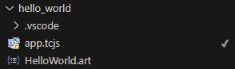

### Complete the Hello World application so it prints the message "Hello World!" to `stdout` and then terminates

An Art application has a [top capsule](https://secure-dev-ops.github.io/code-realtime/building/transformation-configurations/#topcapsule) which is the entry point of the application. When the application starts to run, an instance of the top capsule is created and its state machine starts to execute. The first thing that happens in the state machine execution is that its [initial transition](https://secure-dev-ops.github.io/code-realtime/art-lang/#initial-transition) executes. In the Art syntax the initial transition is defined using the `initial` keyword. 

1. The top capsule is specified in the transformation configuration (TC) file which you see to the <a class="open-file-link" href="app.tcjs">right</a>. Start by making this TC active by right-clicking and performing the command **Set as Active**. The command is also available in the Explorer view, and there the active TC is shown with a checkmark:

2. C++ code is automatically generated for the active TC and is placed in a target folder, named according to the `targetFolder` TC property. Take a moment to locate in the Explorer view the C++ code that has been generated for <a class="open-file-link" href="HelloWorld.art">HelloWorld.art</a>.

_Note:_ It's highly recommended to always have a TC set as active when working in Code RealTime since there are several features and work flows that require the presence of generated C++ code. As long as the TC stays active, the generated C++ code will continously and automatically update to reflect any changes you make in Art or TC files.

3. From the TC file, open the top capsule by `ctrl+click` on the top capsule name `Top`.
4. Edit the top capsule so it prints "Hello World!" to `stdout` and then terminates.