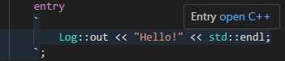
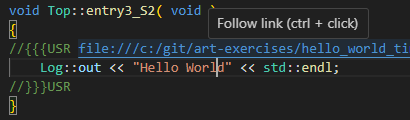

### Complete the application so it prints the message "Hello World!" to `stdout` after a delay of 1 second

A capsule that needs to wait for some period of time should use a [timer](https://secure-dev-ops.github.io/code-realtime/target-rts/timers/). Timers are [ports](https://secure-dev-ops.github.io/code-realtime/art-lang/#port) on which a `timeout` event will arrive when the timer times out. The use of a timer starts by [setting it](https://secure-dev-ops.github.io/code-realtime/target-rts/timers/#set-a-timer). You then specify if you want the timer to timeout only once (a **one-shot timer**) or periodically at a certain interval (a **periodic timer**).

1. Open the top capsule <a class="open-file-link" href="HelloWorldTimer.art">Top</a>. 
2. Add a timer port in the capsule. 
3. Locate the [initial transition](https://secure-dev-ops.github.io/code-realtime/art-lang/#initial-transition) and write code for this transition which will set the timer so it will expire once after 1 second. Use the `informIn` function on the timer port. As can be seen [here](https://secure-dev-ops.github.io/code-realtime/targetrts-api/class_timing_1_1_base.html) there are several overloads of the function. Use the one that takes a single [RTTimespec](https://secure-dev-ops.github.io/code-realtime/targetrts-api/struct_r_t_timespec.html) and specify 1 second and 0 nanoseconds in its constructor. Also check so that the timer could be successfully set by calling `isValid()` on the return value.
4. Add a transition which will transition the state machine from state `S1` to state `S2` when the `timeout` event arrives.
5. If you didn't already do it, set the <a class="open-file-link" href="app.tcjs">TC</a> as active to ensure C++ code is generated for it.
6. Rest your cursor on the entry action code snippet. Since generated C++ code now is available you should see a hyperlink that you can click for navigating to the code snippet inside the generated code.

Alternatively you can accomplish the same thing by means of the context menu command **Open Generated Code**.
7. Change the printout to "Hello World". Make the change in the generated C++ file rather than in the Art file. When you save, your changes will be automatically propagated to the Art file. Check that it worked by `ctrl+clicking` on the hyperlink in the comment just above the code snippet.

8. Change the printout to "Hello World!" by changing the code snippet in the Art file. Navigate again to the generated code and make sure that your change was immediately reflected there.

_Note:_ As seen above you can choose whether you edit a C++ code snippet in the Art file or in the generated C++ file. There are benefits with both ways and what you prefer will depend on the situation.