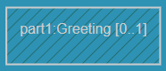

### Make the application print 3 unique greetings by using optional capsule parts

A capsule can be decomposed into [parts](https://secure-dev-ops.github.io/code-realtime/art-lang/#part). Such a part is typed by another capsule, with its own state machine. If a capsule part is declared with the **optional** keyword then an instance of the capsule that types the part will _not_ be automatically created when the container capsule instance is created (as happens for a fixed capsule part). Instead, the container capsule can programmatically create such a capsule instance at any point in time using TargetRTS APIs.

1. Create 3 parts in the <a class="open-file-link" href="Top.art">Top</a> capsule, all typed by the `Greeting` capsule. Call the parts `part1`, `part2` and `part3` and declare them as optional by means of the **optional** keyword.
2. Open the structure diagram of the `Top` capsule to view the top capsule and its parts graphically. You do this by right-clicking inside `Top` and performing the context menu command **Open Structure Diagram**. Note that optional parts are denoted by diagonal stripes in the background:

3. Also note the text `[0..1]` that appears after the capsule name. This denotes the **multiplicity** of the part. Optional parts always have a multiplicity with 0 as lower limit, meaning that they may be empty (i.e. not contain any capsule instances). Try specifying that multiplicity for `part3`. Also try removing the **optional** keyword for `part2` and instead specify the `[0..1]` multiplicity for it. None of these edits change the meaning of the optional parts, but rather shows that you either can specify an optional part using the **optional** keyword, the `[0..1]` multiplicity, or using both at the same time.
4. The TargetRTS provides APIs for dynamically creating instances for the optional parts (something we refer to as **incarnating** the part). In order for the <a class="open-file-link" href="Top.art">Top</a> capsule to access these APIs it needs a **frame port**. Create a behavior port called `frame` in the <a class="open-file-link" href="Top.art">Top</a> capsule and type it with the predefined `Frame` protocol.
5. The [TargetRTS documentation](https://secure-dev-ops.github.io/code-realtime/targetrts-api/class_frame_1_1_base.html) lists several functions that are available to call on the frame port in order to incarnate a capsule part. Call the `incarnate` function that only takes the capsule part (represented by the TargetRTS class [`RTActorRef`](https://secure-dev-ops.github.io/code-realtime/targetrts-api/class_r_t_actor_ref.html)) as argument. You can for example make the call from the initial transition of the <a class="open-file-link" href="Top.art">Top</a> capsule. 
6. Ensure you make one call for each capsule part to incarnate; first for `part1`, then for `part2` and finally for `part3`.