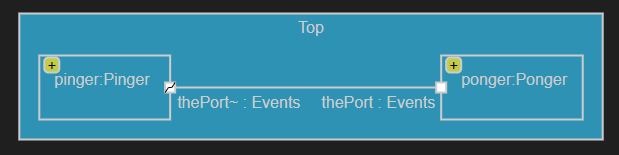
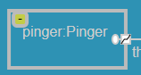
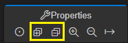

### Make the application send `ping` and `pong` back and forth 3 times

A capsule can be decomposed into [parts](https://secure-dev-ops.github.io/code-realtime/art-lang/#part). Such a part is typed by another capsule, with its own state machine. In this sample application the <a class="open-file-link" href="PingPong.art">top capsule</a> is decomposed into two parts; a `pinger` and a `ponger`, typed by the capsules <a class="open-file-link" href="Pinger.art">Pinger</a> and <a class="open-file-link" href="Ponger.art">Ponger</a> respectively. These parts are **fixed** which means that the capsule instances they contain will be automatically created when the container top capsule instance is created. Hence, when this application is launched, 3 capsule instances are created (the top capsule instance, followed by an instance of `Pinger` for `pinger` and an instance of `Ponger` for `ponger`).

In this exercise the <a class="open-file-link" href="Pinger.art">Pinger</a> and <a class="open-file-link" href="Ponger.art">Ponger</a> capsules are already implemented. They both have a service [port](https://secure-dev-ops.github.io/code-realtime/art-lang/#port) `thePort` on which they can send and receive the events defined in the [protocol](https://secure-dev-ops.github.io/code-realtime/art-lang/#protocol-and-event) called <a class="open-file-link" href="Events.art">Events</a>. Note that `Pinger::thePort` is conjugated (i.e. marked with a ~ after its name) while `Ponger::thePort` is not. Two service ports typed by the same protocol can be connected to let their capsules communicate.

1. Open the top capsule <a class="open-file-link" href="PingPong.art">Top</a>. Note that it already defines the part `pinger` and `ponger`. Also note that a warning is reported for these parts. Read and try to understand what it means.
2. Create a [connector](https://secure-dev-ops.github.io/code-realtime/art-lang/#connector) which connects `pinger.thePort` with `ponger.thePort`. Note that the warnings were resolved by the addition of the connector.
3. Open the structure diagram for <a class="open-file-link" href="PingPong.art">Top</a>. You do this by right-clicking inside it and performing the command **Open Structure Diagram**. 

4. Note the yellow **Expand** buttons with a plus sign on each part. By default the internals of the capsule that types a part is not shown to avoid cluttering the diagram with too much details. Click one of the **Expand** buttons. It reveals that the service port is defined as a behavior port as shown by the "lollipop" icon:

The fact that `thePort` is a behavior port is not something that other capsules, such as `Ponger`, needs to know about, and that's why it's considered as belonging to the "internals" of `Pinger`.

5. The Properties view has toolbar buttons for expanding and collapsing all parts shown in the structure diagram. Try clicking on these buttons to see how they work.

6. Open the state diagram for <a class="open-file-link" href="Pinger.art">Pinger</a> and <a class="open-file-link" href="Ponger.art">Ponger</a>. You can do this by selecting a part in the structure diagram, press `ctrl+space` and then invoke the command **Open State Diagram**. Or you can invoke this command from their respective Art file context menus.
7. Build and run the application. You should see that `Pinger` starts to send `ping` to `Ponger` which replies with a `pong`. This repeats forever (and very fast). Press `Ctrl+C` in the terminal to kill the application.
8. Add a member variable in the <a class="open-file-link" href="Pinger.art">Pinger</a> capsule and store there the number of `ping` events that has been sent. Use that variable so `ping` only is sent 3 times.