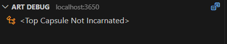

### Step through a capsule state machine using the Art Debugger

In this exercise you will learn the basics of how capsule state machines work, and different ways to edit them in text and state diagrams. You'll also get some practical experience with debugging them using the [Art Debugger](https://secure-dev-ops.github.io/code-realtime/running-and-debugging/debugging/). 

Open the <a class="open-file-link" href="Top.art">Top</a> capsule. It contains a minimal state machine with just an initial transition that enters a state `State`.

1. Rename the state to `InitialState` by placing the cursor on the name and then press **F2**. Note that both the state as well as the reference to it from the initial transition updates. This command is called **Rename Symbol** and is a "refactor" rename which globally renames an element and all references to it. The command is also available in the context menu.
2. Open the state diagram by right-clicking and then perform the context menu command **Open State Diagram**.
3. Note the blue circular icon on the initial transition which shows that there is a snippet of C++ code that will run when this transition executes.

Double-click on the blue icon to navigate to the code snippet in the Art file.

4. Create two new states `StateA` and `StateB` in the state machine. Create the first state from the Art text editor by placing the cursor on a new line after the declaration of `InitialState` (after the semicolon), press `ctrl+space` and perform the command **New State**. Note that the new state immediately shows up in the diagram. Create the second state from the state diagram by clicking in the diagram background, press `ctrl+space` and perform the command **New State**. Note that the new state immediately shows up in the Art text editor where you can give it a name.
5. Create a [triggered transition](https://secure-dev-ops.github.io/code-realtime/art-lang/#transition) from `InitialState` to `StateA` using the Art text editor. Put the cursor on a new line at the end of the state machine (before its trailing `}`), press `ctrl+space` and perform the command **New Triggered Transition**. Fill in the following information:

* fromState: `InitialState`
* toState: `StateA`
* port: `comPort`
* event: `e1`

Note that the transition shows up in the state diagram as a line between `InitialState` and `StateA`.

6. Create a [triggered transition](https://secure-dev-ops.github.io/code-realtime/art-lang/#transition) from `InitialState` to `StateB` from the state diagram. Select first `InitialState` and then `StateB` (by holding down the `ctrl` key). The states should now have a thicker border to show that they are both selected:

Then press `ctrl+space` and perform the command **New Triggered Transition**. The new transition appears both in the diagram and in the Art file. You need to specify the port `comPort` and the event `e2` in the Art editor. Your state diagram should now look like this:

7. Give the new transitions names (for example `e1` and `e2`) by typing the names before the transitions followed by a colon `:`. It's good practise to name transitions, and if you cannot come up with a better name, use the name of the event which triggers it. This makes it easier to read and understand the state machine from the state diagram.

8. Write the effect code for the transitions, i.e. the code that should run when the transitions are triggered. Replace the placeholder comment with code that prints a message to `stdout`. For example "Transition e1 runs".

9. Build and run the application. You should see the printout from the initial transition but none of the others. The state machine waits in `InitialState` and for it to transition to another state it needs to receive either event `e1` or `e2` on the `comPort`. Let's use the Art Debugger for making that happen.

10. Kill the application by pressing `ctrl+C` in the terminal.

11. Start the Art Debugger by following these steps:

* Switch to the **Run and Debug** view from the left navbar
* Click the hyperlink to create a `launch.json` file and browse to the `statemachine_debug` workspace folder
* Click the green arrow in the toolbar to start debugging

You will be prompted to select which TC to use (there is only one).

12. Locate and expand the **Art Debug** view (usually found in the bottom left corner of the window).

This view shows where the debugged application is running (localhost) and which port the debugger is attached to (3650). We can also see that the application was suspended right after start-up and that the top capsule hasn't yet been incarnated.

13. Press the **Continue** button in the Debug toolbar:

This will resume execution of the application and the following will happen:

* The top capsule will be incarnated
* The initial transition of the top capsule state machine will run (you can confirm it by looking at the printout in the **Debug Console** view)
* The state machine will enter the `InitialState`

In the debug view we can see that `InitialState` is the currently active state of `Top`'s state machine. We can also see the service port `comPort` which we can use for sending events to the top capsule.

14. Rest the cursor over the `comPort` and click the **Send Event** arrow. All in-events (i.e. events that can be sent in to the port) are listed. Select `e1`. Observe that the active state changes to `StateA` and that the effect code snippet of transition `e1` executes and prints the message you wrote to the **Debug Console**.

15. Since there is no transition that leaves `StateA` nothing more can happen in the application and it will stay in that state forever. Press the **Restart** button in the debug toolbar to restart the application. Repeat the same procedure as before but this time send the event `e2` instead. That event has an `int` parameter and you will be prompted to specify a value for it. 

16. Adjust the effect code for transition `e2` so that it prints the `int` value that is passed with the event. Then debug the application again and ensure it's printed correctly. 